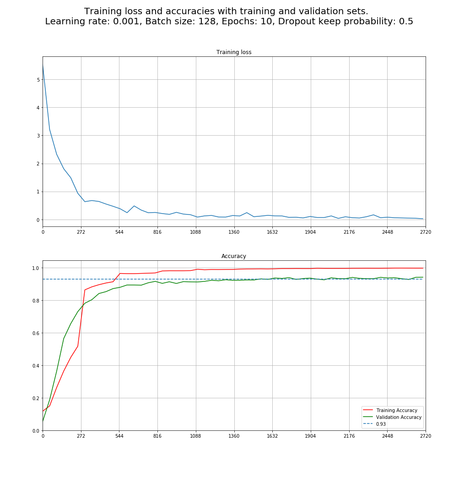
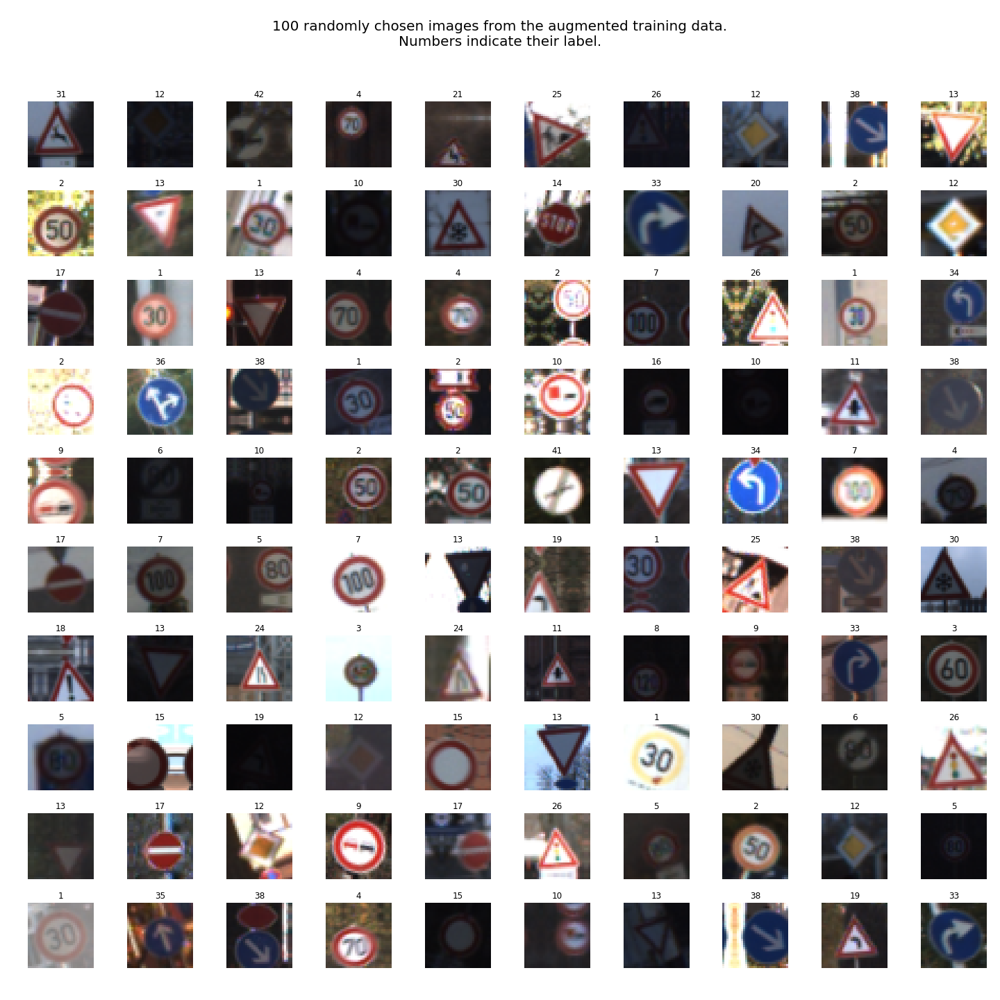
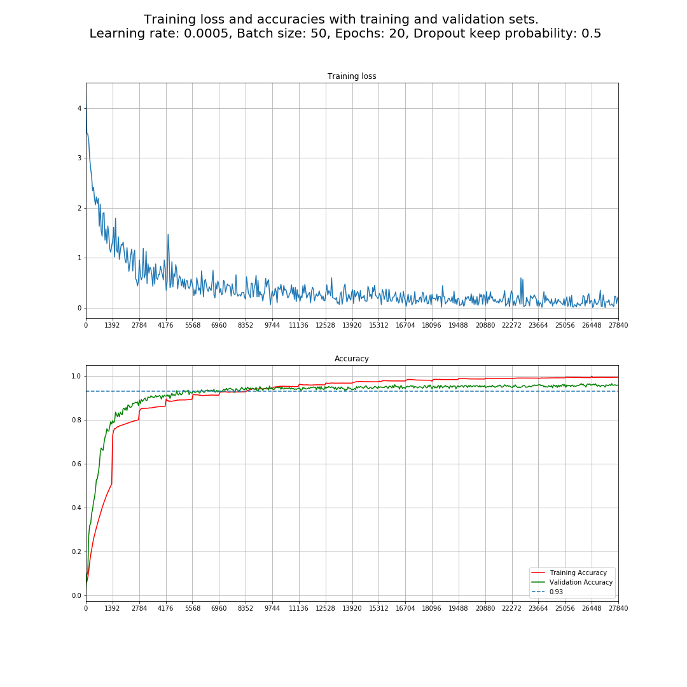

# Self driving car nanodegree

## Project 3: Traffic sign classifier

This project consists of a convolutional neural network capable of determine what kind of traffic sign is presented to it. Specifically it classifies some german traffic signs (not all of them). For training, validation and testing of the model the german traffic sign dataset is used.

The programming language used is Python and the libraries used are TensorFlow, Numpy, OpenCV, Scikit-Learn and Tqdm.

### About the dataset

The dataset contains 43 different traffic signs actually used on german streets. It contains 51839 examples distribuited in 34799 training examples 4410 validation examples and 12630 test examples.

 

 

 

By printing 100 randomly chosen images from the train, validation and test data, it can be seen that the images are taken in different light conditions, different perspectives and different sharpness levels. Some images have stickers ore some other perturbations as well. So it is a good dataset to start with.

Let's now analyze how many images are from every class on the three datasets:

From the three plots can be seen that the images are almost equally distribuited on the train, validation and test datasets.

It can also be seen that some signs are more frequent than other. The speed limits from 30 km/h to 80 km/h (labels from 1 to 5) are more frequent than the speed limit 20 km/h (label 0). The end of speed limit 80 km/h is also not that frequent (label 6). The speed limits 100 km/ and 120 km/h (label 7 and 8) are also very frequent, but not that much like the lower ones. This can result that the neural network will be more prepared to recognize speed limit trafic signs between 30 km/h and 80 km/h than to 20 km/h, because it will have more exposition to these ones.

A similar situation can occur with the sign "No passing for vehicles over 3.5 metric tons", which is also very frequent (label 10), more than the normal "No passing" sign (label 9).

Other situation like that is between the signs "Keep right" (label 38) and "Keep left" (label 39). The "keep right" sign is way more frequent than the "keep left" one. That can result on "Keep left" images being recognized as "Keep right" since they are very similar.

### Preprocessing the data
The next step is to preprocess the data in order to be used to train, validate and test the neural network. This preprocessing consist on normalizing the images, so their values are between -1 and 1. Note that this processing is done for all three color channels of the images.

This normalization is done in order to get a good conditioned dataset which performs well with the optimizer used to train the neural network. A bad conditioned dataset could result on overflows while performing the optimization.

The next step would be to augment the data doing translations, rotations, zooms, etc. This is done in order to have a more diverse dataset which makes the neural network learn the signs even if the position or size is different than it should be, making it more robust.

In this project this is done lately in order to increse the performance of the selected model, for now it will be worked on the raw dataset. 

### Selection and creation of a model

The Yann LeCunn's LeNet-5 neural network was selected as a starting point for the neural network arquitecture. This network was developed by Yann LeCunn to classify handwritten numbers from 0 to 9, but it can be easilly used for other image classification tasks.

The original LeNet-5 network consisted of the following layers:

- Convolution layer with input size 32x32x1 and output size 28x28x6. Kernel size of 5x5 and stride of 1.
-  Average pooling layer with input size 28x28x6 and output size 14x14x6. Kernel size of 2x2 and stride of 2.
- Convolution layer with input size 14x14x6 and output size 10x10x16. Kernel size of 5x5 and stride of 1.
- Average pooling layer with input size of 10x10x16 and output size of 5x5x16. Kernel size of 2x2 and stride of 2.
- Convolution layer with input size of 5x5x16 and output 1x1x120. Kernel size of 5x5 and stride of 1.
- Fully connected layer with input size of 120 and output size of 84.
- Fully connected layer with input size of 84 and output size of 10.

Between all internal layers the activation function hyperbolic tangent (tanh) was used.

This structure can be explained with the following image (Original Image published in [LeCun et al., 1998] )

The model was changed in order to be usable for this classification task.

- The input now takes RGB images, so the input size of the first convolution layer is 32x32x3.
- The last convolution layer with output 1x1x120 was eliminated and the output of the last pooling layer with output 5x5x16 was transformed into an array of 400 elements in order to be processed by the first fully connected layer.
- A new fully connected layer was added to process the 400 values of the flattened vector and give out 120. These two steps are kind of equivalent to the convolution layer with output size 1x1x120, but with this approach it is easier to separate between the convolutional part of the network and the fully connected part.
- Dropout was added for the two deep fully connected layers in order to avoid overfitting. 
- The output is now of size 43, which is the quantity of classes for this dataset.

The activation functions where changed from hyperbolic tangent (tanh) to ReLU for two reasons:

- With a lot of layers, the tanh function can cause the gradient to vanish (make it very close to 0), since its derivative is always smaller than 1. That multiplied a lot of times will result on a very little gradient for the layers close to the input.
- Using ReLU is more computationally efficient since it only consists of determine the maximum value between 0 and the output of the layer. Also its derivative is either 0 or 1.

In order to avoid overfitting (that the neural network learns so well the training data and has problems while working with new data), dropout is used for the fully connected layer after the convolutional part of the network.

So, the new network arquitecture looks like following:

- Convolution layer with input size 32x32x3 and output size 28x28x6. Kernel size of 5x5 and stride of 1.
- Average pooling layer with input size 28x28x6 and output size 14x14x6. Kernel size of 2x2 and stride of 2.
- Convolution layer with input size 14x14x6 and output size 10x10x16. Kernel size of 5x5 and stride of 1.
- Average pooling layer with input size of 10x10x16 and output size of 5x5x16. Kernel size of 2x2 and stride of 2.
- Flatten operation from the output of the last pooling layer with input size of 5x5x16 and output size of 400.
- Fully connected layer with input size of 400 and output size of 120. Dropout used while training.
- Fully connected layer with input size of 120 and output size of 84. Dropout used while training.
- Fully connected layer with input size of 84 and output size of 10.

The function "LeNet_V1" implements this network on tensorflow. This function is saved in the file "LeNetV1.py"

### Training of the selected model

#### Training with selected initial conditions

The model was trained doing 10 epochs, with a batch size of 128, a learning rate of 0.001 and a probability of keeping nodes on the deep fully connected layers of 50%.

For optimization, instead of using the traditional stochastic gradient descent algorithm which only uses the gradient of the model weights and biases and the learning rate, the Adam Algorithm was used.

The Adam Algorithm described by Diederik Kingma and Jimmy Lei Ba on their 2015 paper "Adam : A method for stochastic optimization" does not use directly the gradient in order to change the parameters. Instead, it uses the first and second moment of the gradients in order to create an update term for the parameters which changes through the time. This algorithm has gained a good acceptance in the last years and is seen as the first option when working with big deep neural networks.

Training the model with these conditions resulted on a training accuracy of 98% and a validation accuracy of 94%. The next image shows the evolution of the model through the training. The X axis represents the training batches and the ticks on the X axis represent the start of a new epoch, so it can be identified how good was the model at that epoch. 

From the two graphics it can be seen that the network with the given hyperparameters does the biggest part of the training during the first five epochs. At the end of the fifth epoch it reaches already a validation accuracy of 90%. In the next five epochs the validation accuracy grows very slowly but steady. It also can be seen from the loss function that the model was still getting better when the training ended, which can mean that a bigger number of epochs would result in an even higher validation accuracy.

#### Generalized function for training and validation
At this point, a function which performs the training and the validation was programmed in order to make easier the testing with different hyperparameters and models. This function is called "trainNetwork" and is stored in the file "LeNetV1.py". This function takes the following parameters:

- trainImages: Array of images used for training
- trainLabels: Array of labels used for training
- validImages: Array of images used for validation
- validLabels: Array of labels used for validation
- lossTensor: TensorFlow tensor used to calculate the training loss of the model.
- trainingTensor: TensorFlow tensor used to calculate the new weights and biases for every batch of training data. It consists of the minimize operation of the optimizer using the lossTensor.
- accuracyTensor: TensorFlow tensor used to calculate the accuracy of the model.
- X_ph: TensorFlow placeholder for the images used on training, validation and test.
- Y_ph: TensorFlow placeholder for the labels used on training, validation and test.
- keepProb: TensorFlow placeholder for the probability of keeping nodes on the deep fully connected layers during training.
- epochs: 32-bits float indicating the quantity of epochs needed for training
- batchSize: 32-bits int indicating the size of the training batch
- dropoutKeepProb: 32-bits float indicating the probability of keeping nodes on the deep fully connected layers during training.

This function shuffles the data before doing the batches and use them for training.

This function also logs the training process saving the loss, training accuracy and validation accuracy every 50 batches.

This function returns the following data:
- batchesList: List indicating the batch numbers at which samples were logged.
- lossList: List indicating the loss at a given batch number (from batchesList).
- trainingAccList: List indicating the training accuracy at a given batch number (from batchesList).
- validationAccList: List indicating the validation accuracy at a given batch number (from batchesList).

These four lists are used in order to plot the training process.

#### Training with 5 more epochs

By looking at the new graphics, it can be seen that the performance of the network didn't really improved by increasing the number of epochs. The last validation accuracy was also of 94%, which means that with the given learning rate, the network converges to a solution within the first 10 epochs.

Let's try decreasing the learning rate a bit and keep the epochs by 10. Decreasing the learning rate should make the convergence of the network slower, but it makes it possible that the performance increases a bit.

#### Training with lower learning rate

Decreasing the learning rate did not improve the performance of the network, it actually decreased it a little bit (from 94% to 93%). Since the Adam optimizer is being used, which decreases the learning rate through time, a good option may be to increase it a bit instead. Let's set it to 0.002.

#### Training with higher learning rate

Increasing the learning rate to 0.002 clearly decreased the performance of the model. It looks like the best learning rate for this model using the Adam optimizer is 0.001. Also it looks like that the model will not get better by changing the hyperparameters. But what about creating a bigger model?.

### Definition of an improved model

The model until now is almost the same used by Yann LeCunn to clasify hand written numbers. Now we are working with images with more information where color is also a factor, and also there are more labels, so it seems logic to make a bigger model than Yenn LeCunn's.

Let's define the network arquitecture like following:

- Convolution layer with input size 32x32x3 and output size 32x32x10. Kernel size of 5x5 and stride of 1.
- Max pooling layer with input size 32x32x10 and output size 16x16x10. Kernel size of 2x2 and stride of 2.
- Convolution layer with input size 16x16x10 and output size 16x16x18. Kernel size of 4x4 and stride of 1.
- Max pooling layer with input size of 16x16x18 and output size of 8x8x18. Kernel size of 2x2 and stride of 2.
- Convolution layer with input size of 8x8x18 and output size of 6x6x30. Kernel size of 3x3 and stride of 1.
- Flatten operation from the output of the last pooling layer with input size of 6x6x30 and output size of 1080.
- Fully connected layer with input size of 1080 and output size of 490. Dropout used while training
- Fully connected layer with input size of 490 and output size of 220. Dropout used while training.
- Fully connected layer with input size of 220 and output size of 43.

As seen, the network has a new convolutional layer and a new fully connected layer. The new convolutional layer should recognize more abstract features on the images like characters or complex symbols. Every convolutional layer has also more feature maps, resulting on more shapes recognized on every layer. The new fully connected layer makes it possible to classify those more complex feature maps of the new convolutional layer.

There is also a negative aspect: the original neural network has 64811 parameters, this new one will have 655761 which is ten times the original one, this is important to know since a very big model can result on memory problems.

The new function is called "LeNet_Improved" and is located in the file "LeNetV1.py"

#### Training of improved model

#### Training with selected initial conditions

The improved model was trained firstly using the same hyperparameters used at the beginning with the first model.

It can be seen that this network performs sightly better with a validation accuracy of 94% and sometimes of 95%. It also converges way faster than the first model and the training accuracy reaches 100%. Let's decrease the learning rate to 0.0005 to see what happens.

#### Training with lower learning rate

Decreasing the learning rate to 0.0005 really improved the performance of the model. Now it achieves a steady validation accuracy of 95% and even reached 96% once. However, it is only 1% more. It seems that the performance will not get any better without changing the data.

### Data augmentation

Since the validation accuracy of the model(s) is not getting better with the normal data, it was decided to augment it. Three methods where selected to augment the data: Translation, rotation and zooming. For that, three functions where created: translateImage, rotateImage and zoomImage respectively. These functions use the OpenCV library and are located on the file "DataAugmentation.py".

Let's see what the functions can do applying it to a test image.

It can be seen that the three functions do a good job applying the desired operation on the test image. They also conserve the shape of the original image, which is very important in order to use them for the training of the model.

In order to augment every image of the training dataset, the function "augmentData" was created (located on file "DataAugmentation.py"), which receives as input the original data and labels and gives as output the original data plus their augmented versions and therefore it duplicates the size of the data. It takes 4 parameters which are choosen carefully thinking about what the neural network would receive as input in the real life. So the translation was restricted to 8 pixels to any direction, the rotation to 15 degrees to the right or to the left and the zooming to a range between -4 and 4.

The following are 100 randomly chosen augmented images of the training data:

From visualising the new augmented data, it can be seen how now rotated, zoomed and translated images are present on the dataset.

#### Training of the model with augmented data

##### Using improved model with last chosen hyperparameters

The model reached 95% accuracy like before without the augmented data. But here it can be seen that the model can still learn a little bit having more epochs. Let's increase the number of epochs to 20 and see what happens.

##### Using 10 more epochs

By increasing the epochs to 20 the validation accuracy increased to 96%. Here the training accuracy reached 99%, which means it is not probable that the model performance gets better by increasing the number of epochs.

It seems that the model will not get any better with this dataset, probably because some images are very dark and therefore difficult to identify. If that is the problem, a good idea would be to increase the contrast or the brightness of the images, but that would mean that this calibration would also be necessary on the system where the model would be used, what may not be possible. Therefore this is the definitive version of the model on this project.

#### Test accuracy of last trained model

In order to calculate the test accuracy of a model, the function "testNetwork" was programmed, which can be found on the file LeNetV1.py. This function takes the following arguments:

- testImages: Array of images used for testing
- testLabels: Array of labels used for testing
- accuracyTensor: TensorFlow tensor used to calculate the accuracy of the model.
- X_ph: TensorFlow placeholder for the images used on training, validation and test.
- Y_ph: TensorFlow placeholder for the labels used on training, validation and test.
- keepProb: TensorFlow placeholder for the probability of keeping nodes on the deep fully connected layers during training.
- batchSize: 32-bits int indicating the size of the testing batch

The function first shuffles the data and then calculates the accuracy on little batches of the testing data. At the end it calculates the average of the testing accuracy on all testing batches.

Using this function, the test accuracy obtained by the model was of 95,5%, very close to the validation accuracy of 96%, this is a very good value since the test data are images that were never seen by the model and therefore the test accuracy is always smaller than the validation accuracy.

#### Testing on new images

Five new images were chosen in order to test the model with them.

- A keep left sign in diagonal perspective
- A 30 km/h speed limit sign in diagonal perspective
- A stop sign with snow on it which covers the word "stop".
- A wild animals crossing sign showing a deer with wings.
- A 60 km/h speed limit sign shown on a screen with black background color instead of white.

In order to be able to use the images, the model needs the new images to be resized to 32x32 resolution and to be normalized to a range between 0 and 1. The normalization range was changed here because using -1,1 was destroying the jpg images downloaded from internet. The model was also trained again using this normalization getting the same training, validation and test accuracies.

Here it is shown how the original images and their resized and normalized versions look like:

By running the model on these five images almost perfect accuracy was reached. Only the stop sign with snow was wrongly classified. This is analysed now with more details using the 5 highest probabilities the model returns for these images.

##### Analysis of results image 1

Following is a table of the the highest 5 probabilities for the image 1 "keep left".

| Label 	|  Probability 	|
|:-----:	|:------------:	|
| 39    	| 9.923333e-01 	|
| 33    	| 4.446560e-03 	|
| 37    	| 3.216590e-03 	|
| 40    	| 2.928818e-06 	|
| 35    	| 4.397555e-07 	|

And a plot of the probabilities for all the possible layers:

It can be seen that the model is almost completely sure about this prediction, it believes with 99,92% probability that the image has label 39, which means "keep left", this is correct so the model was right here.

The next probability is 0.44% for the label 33 (Turn right ahead) which is similar to the traffic sign "keep left" having also an arrow but pointing to the right.

Other similarly high probability is 0.32% for the label 37 (Go straight or left). This sign has also an arrow pointing to the left like the sign "keep left".

The other two probabilities are very low 0.0029% for the label 40 (Roundabout mandatory) and 0.00042% for the label 35 (Ahead only). These images are also blue and have arrows, but in other directions. It seems that the background color of the sign is a very important feature in order to classify them. But more important in this case are the arrows and their orientation.

The label 38 corresponding to the keep right label was not between the 5 highest probabilities as one could believe by analising the distribuition of the dataset where the keep right sign appears way more often than the keep left one.

##### Analysis of results image 2

The next image is a 30 Km/h speed limit sign with a small additional sign at the bottom.

| Label 	|  Probability 	|
|:-----:	|:------------:	|
| 01    	| 9.999999e-01	|
| 00    	| 6.843775e-08	|
| 02    	| 1.023974e-12	|
| 14    	| 2.058977e-16 	|
| 03    	| 1.787595e-16 	|

 

For this image the model is very sure that the image is 30 km/h with a probability of 99.99999% of being label 1 (Speed limit 30 km/h). The next probability is of 0,000008% is for the label 0 (20 km/h). The other probabilities are extremely low for the label 2 (Speed limit 50 km/h), label 14 (Stop) and label 3 (Speed limit 60 km/h) in decreasing order. It is interesting to remark that the stop sign is more probable than other speed limit signs, which could indicate that for the model is more important the text in the middle of the image than the background color. It looks that the model recognizes very well the difference between 2, 3 and 5.

##### Analysis of results image 3

This image is a stop sign with snow on it covering the word "STOP".

| Label 	|  Probability 	|
|:-----:	|:------------:	|
| 15    	| 9.997937e-01	|
| 14    	| 2.061872e-04	|
| 13    	| 6.774215e-08	|
| 09    	| 4.734326e-08	|
| 02    	| 2.830689e-10 	|

 
 
 The results for this image are very interesting because the model got it wrong here. It predicted with 99,97% probability that the image is of label 15 which means "no vehicles". This image has a red border and a white center, similar to what the snowed stop sign looks like. The next probability is of 0.02% for the correct label which is 14 (Stop sign) The other probabilities are very low for the labels 13 (Yield), 9 (No passing) and 2 (Speed limit 50 km/h) in decreasing order. All these images have white as background. With these data it can be said again that for the model is the background color a very important feature in order to clasify. 
 
The model did not have the possibility here to have this answer right maybe because it have never seen a snowed stop sign during training. 
 
##### Analysis of results image 4

The next image is a "wild animals crossing" sign with the peculiarity that the deer on it has wings (maybe because some person drawn them).

| Label 	|  Probability 	|
|:-----:	|:------------:	|
| 31    	| 9.995307e-01	|
| 21    	| 2.572956e-04	|
| 23    	| 2.118550e-04	|
| 29	    	| 1.298086e-07	|
| 25    	| 6.865176e-08 	|
 
 

Here is also the model very certain about its prediction. With 99.953% it predicts that the image is a "wild animals crossing" sign (label 31). The next probability is of 0.0257% for label 21 (Double curve), this sign has a similar drawing on it with almost the same form. The next probability is 0.0211% for the label 23 (Slippery road), this sign has a car drawing and two drawings of curve lines on it which have the same orientation than the double curve on the sign 21. The next probabilities are very low for the labels 29 (Bicycles crossing) and 25 (Road work) respectivelly, these signs are also red triangles with white background and black symbols on it, but the symbols have completely other forms.

##### Analysis of results image 5

The last image is a 60 km/h speed limit sign with black background because it is electronic.

| Label 	|  Probability 	|
|:-----:	|:------------:	|
| 03    	| 0.814279	|
| 02    	| 0.123054	|
| 05    	| 0.030831	|
| 14	    	| 0.020340	|
| 01    	| 0.007349	|

 
 
This is the only image where the model had real doubts. It predicted it well but with a probability of "only" 81% (label 3). The next probability is of 12% for label 2 (Speed limit 50 km/h). After that, the next one is 3% for the label 5 (80 km/h). All these signs are speed limit signs. The next probability is of 2% for stop sign, again, it may be recognized as alternative because of the text, specially the 6 and 0 look similar to S and O. The last probability is 0.7% for label 1 which is speed limit 30 km/h.

The reason why for this image the probabilities are more varied is for sure not the background color, it is rather more the thickness of the characters, for this electronic sign the 60 is thinner than for the normal speed signs, that makes it more difficult to identify after the image was resized to 32x32 as it can be seen above.

Images like this or the stop sign with snow on the validation and test data can result on wrong answers by the model and therefore a lower accuracy than the training accuracy.

#### Visualization of convolutional layers results

In order to visualize the outputs of the convolutional layers and with that know more deeply what the model finds important, it is needed to extract the tensors which execute the convolution from the saved model. In order to do that the tensors conv1out, conv2out and conv3out of the function "LeNet_Improved" are needed. In order get them, the operation "tf.get_default_graph().get_tensor_by_name" is used. This method takes as argument the name of a tensor. Since for these tensors no names were defined at the moment the model was trained, they are called as default "BiasAdd", "BiasAdd_1" and "BiasAdd_2".

The feature maps resulting as outputs of the convolutional layers are extracted using the function "outputFeatureMap" present on the notebook.

The image used is the keep left sign used before

The first convolutional layer gives out the following feature maps for this image:

 
It can be seen how it is is looking for the lines which resembles the border of the sign and the arrow.
 
The feature maps from the second convolutional layer for this image are the following:
 

  
In this, it seems to be looking for patterns drawn from the bottom left corner to the top right corner, which corresponds to the orientation of the arrow on the sign.
  
The feature maps from the third convolutional layer for this image are the following:
  

On these feature maps it can be seen again that the model is looking for diagonal lines between the bottom left corner and the top right corner. Unfortunately, because of the low resolution of the images and of the feature maps, it is difficult for a human to interpretate them.

Other image worth to be analysed is the stop sign with snow on it.

The first convolutional layer gives out the following feature maps for this image:

Here it can be seen that the model is not capable to recognize any text and it gives a lot of importance to the edges of the snow in the sign.

The feature maps from the second convolutional layer for this image are the following:

On this layer, it can be seen that the model again is giving a lot of importance to the white space at the center of the image. That can be confirmed by looking at the third layer:

Most feature maps have a white circle on the center, which means, this is the most important feature of this image. The following fully connected layers then classify that big white spot as a "no vehicles" sign. 

It could be possible that a model with one less convolutional layer would doubt more about this prediction since the model would not be looking for so complicated patterns. The same could be said about the last image. Since the model is capable of finding complicated patterns like diagonal lines or circles, it is very sure about its predictions when it finds one of those patterns. That could explain the very high probabilities for the test images (being right or not).

#### Summary and conclusions
Convolutional neural networks are a very strong tool in order to classify images. The first convolutional layer looks for simple patterns like lines. The following layers look for more sofisticated forms. Then the output of the last convolutional layer gets classified using fully connected layers.

One of the most important steps in order to get a high accuracy of the model is to choose the right optimizer. Alone by choosing the right optimizer and some roughtly selected hyperparameters, a very good accuracy can be achieved.

By using dropout on the fully connected layers it is avoided that the model memorizes the training set and then it is not capable of classifying new images resulting on a bad performance on the validation and test data.

The preparation of the data is also a very important step in order to get good results. By normalizing the data to values close to 0, it makes it easier for the optimizer to look for good solutions. It also avoids overflows on the entire process. The same can be said for the weights of the model. By starting them randomly with 0 average and 1 standard deviation, it makes it easier for the optimizer to look for them and move them to a better solution.

By decreasing the learning rate, a bit higher performance can be achieved, but the model will also converge lately, needing more epochs in order to achieve the desired results.

Augmenting the data is also a good technique in order to get a higher performance from the model. It may be also necessary in order to show the model data with different lightning conditions or also climatic conditions. For example, it might not be easy to get photos of stop signs with snow on them, but they can be easily modified in order to have some snow on it. A very big area of work is concentrated only in augmenting data so good performant models that work on different situations can be achieved.

By exploring the convolutional layers of a model, it can be seen what for the model is really important. Normally the recognized shapes get more complex in the later convolutional layers closer to the fully connected layers. In the case of this model, that is very difficult to see, since the images originally where of low resolution and therefore, the feature maps of the last convolutional layer have an even lower resolution. Although, in the two analyzed images it can be seen why the model is so certain about it predictions. It is because it can identify very well what is important for it, in the case of these two images, diagonal lines and a big white circle on the center of the image.

 

 

